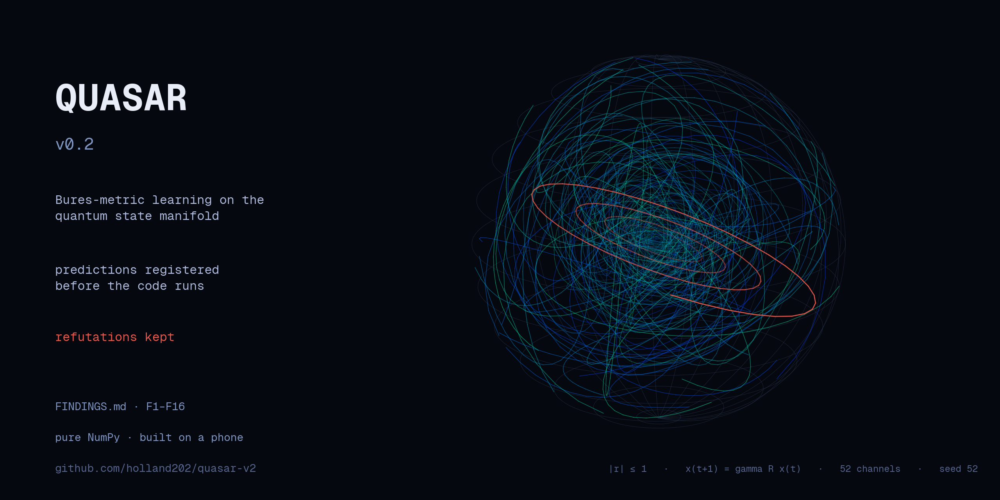

> ## Start here
>
> **QUASAR** is a closed-loop learner that **generates its own training data** and
> **directs its own curriculum** — built for the case where human-authored
> training material runs out. Every claim carries a numbered prediction,
> registered before the code runs. Failed predictions are kept and marked, not
> deleted — [FINDINGS.md](FINDINGS.md) is the lab notebook: **18 entries
> (F1–F18)**, including the refutation of this project's own founding premise.
>
> **The headline result is a refutation.** F18 tested the claim the QGT header
> had made since v0.1 — that Bures-metric attention beats dot-product. Matched
> budget, identical init, only the score function differing: **GEO beat DOT in
> 0 of 5 seeds.** The geometry is worth a rounding error. That claim is now
> marked refuted and kept in full rather than quietly dropped.
>
> **What survived is the curriculum.** F16: error is *not* learnability
> (corr = −0.999). Error-driven sampling pours budget into the bin where
> learning is least possible and lands **8.08% worse than uniform, 0/5 seeds**.
> Progress-driven sampling — weight by recent error *reduction*, not error
> level — wins **5/5, +3.30%**. Enforced in CI on every push.
>
> Self-tests pass on a cold clone: QGT 6/6 suites, `backprop.py` V1–V4. Pure
> NumPy — no cloud, built and verified on a Galaxy S25 Ultra.
>
> v0.1 is [archived](https://github.com/holland202/quasar) as the public
> timestamped baseline; this repo is where the work is active.

# QUASAR v0.2

Development repo, now public. Public timestamped baseline:
github.com/holland202/quasar (v0.1). Start with FINDINGS.md — it is the lab
notebook and the roadmap.

## What this is

A closed loop with three parts: a **generator** that synthesizes training
trajectories from the geometry of its own state space, a **curriculum** that
decides which examples to generate next, and a **learner** that trains on
them. No human-authored corpus anywhere in the loop.

The substrate is single-qubit channel dynamics — small enough to be
exhaustively checkable in pure NumPy on a phone, rich enough to have a real
difficulty axis (generator strength ω) to build a curriculum over.

**Scope, stated plainly:** classical simulation of single-qubit geometry. No
quantum hardware, no quantum-advantage claim. This is a principle
demonstration, and the principle under test is *self-generated curriculum*,
not the metric — F18 settled the metric question, negatively.

## The two results that matter

**F16 — error is not learnability.** Measured per-bin: high-error bins are
*not* the most learnable ones (corr(final error, learnability) = −0.999). The
hardest bin carries large irreducible error, so error-proportional sampling
starves the bins where learning is achievable. Progress-proportional
sampling — weights ∝ recent error reduction — fixes it: +3.30%, 5/5 seeds,
versus error-driven at −8.08%, 0/5. Gated by `n2c_check.py`, enforced in CI.

**F18 — the founding premise is refuted, and kept.** Bures attention does not
beat dot-product: 0/5 seeds, mean gap +0.0007. Registered before running, with
an anti-vacuity floor (both arms beat predict-mixed and predict-last, so the
task was learnable and the comparison informative). A harness bug found
mid-run — a wrong superfidelity constant that made the n=2 arm train nothing
and emit fake zeros — is documented in the entry rather than silently patched.

## Running it

```bash
pip install numpy

python3 lucid2q.py                        # T1–T6 self-tests, ~7s
python3 backprop.py                       # V1–V4 autodiff checks, ~2s
python3 quantum_geometric_transformer.py  # QGT suites, ~1s
python3 n2c_check.py                      # F16 curriculum gate, ~4 min
python3 n2c_check.py --sabotage           # proves that gate can fail
```

Pure NumPy, no GPU. On Android/Termux, `export TMPDIR=$HOME/tmp` first — `/tmp`
is not writable there.

## Instruments

`mediation_probe.py` is kept as a **documented methodology trap** — read
FINDINGS F1 before trusting any intervention probe. `broadcast_probe.py` is
the corrected instrument (current baseline broadcast ratio 0.001).

Every gate in this repo is required to demonstrate it can *refuse* before its
passing verdict is trusted. `n2c_check.py --sabotage` forces the
degenerate-curriculum branch and must exit 1; CI fails the build if it ever
exits 0.
